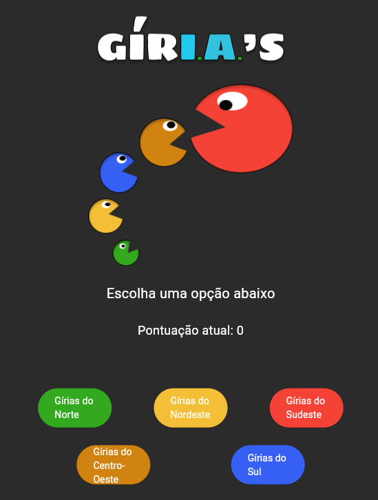
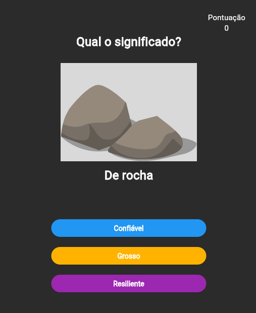

# GIRI.A'S

## Descrição
O projeto GIRI.A's consiste em uma aplicação em flutter, um jogo onde o usuúario deve adivinhar o significado da gíria regional para ganhar pontos. O jogo te permite selecionar quais regiões você deseja incluir no seu Quiz.

## Autores
- João Paulo Cardoso da Paixão
- Lívia Chiemi Aruga Lobo
- Mário Sérgio Brito Pires Santos

## Screenshots

